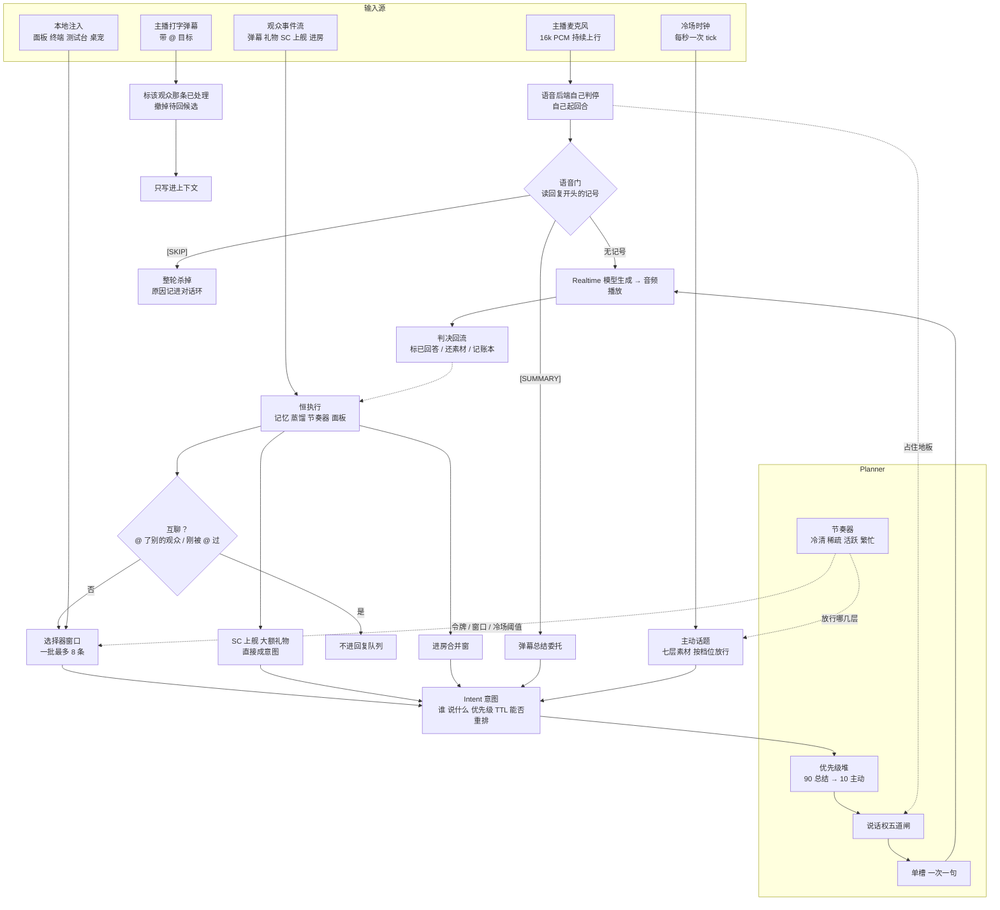

# BiliSama

B 站直播的 AI 伴播：听得见主播说话、看得见弹幕礼物、用自然语音参与直播，把单人直播变成双人节目。
出厂人设叫**豆腐**。

[Agent 架构](#agent-架构) · [功能清单](#功能清单) · [交互逻辑](#交互逻辑) · [执行教程](#执行教程) · [目录结构](#目录结构) · [文档索引](#文档索引)

---

## Agent 架构

一句话：**五个输入口，一个出口。** 五条输入各走各的处理链，除了主播的声音之外，全部变成
`Intent`（意图），再挤过同一个单槽，一次只说一句。planner 要回答的只有一个问题：此刻这个槽给谁。



主播的声音是唯一的旁路：语音后端听到人说话就自己起了回合，程序没有"要不要回"的决定权，只能在
回复开头读一个记号决定杀还是放。它不进优先级堆，但一开口就占住地板，堆里所有意图一起等。

### 分层

| 层 | 目录 | 负责 |
|---|---|---|
| L1 界面 | `ui/`、`desktop/preview/` | 桌宠网页与面板、意图测试台、直播 Mock、桌面悬浮窗壳 |
| L2 语音链路 | `realtime/` | `SpeechLink` 抽象；DashScope、火山豆包、本地 s2s、OpenAI 四家适配；上行、打断、播放回执 |
| L3 编排 | `director/`、`app.py`、`proactive*.py`、`memory/`、`persona/` | 意图、优先级、说话权、语音门、处理记录、主动话题、记忆、人设与 Prompt 拼装 |
| L4 接入 | `ingest/`、`event_pacing.py` | B 站直播间（blivedm）、事件模型、选择器、互聊判定、节奏器 |

全部跑在一个 Python 3.12 asyncio 进程里；只有本地语音引擎（s2s）因为依赖版本冲突单独起进程。

### 五个输入源，各自怎么走

| 输入源 | 进来的是什么 | 怎么处理 | 谁有决定权 |
|---|---|---|---|
| 主播麦克风 | 16k PCM，20ms 一包，关麦也发静音包 | 语音后端判停、自己起回合；语音门读回复开头：没记号照播，`[SKIP]` 整轮杀，`[SUMMARY]` 转成弹幕总结；转写里明确说了"看下/整理弹幕"而模型写了 `[SKIP]`，程序按委托兜底 | 模型（事后由门执行） |
| 观众事件流 | blivedm 推来的弹幕、礼物、SC、上舰、进房、关注点赞 | 先写记忆、喂节奏器、进面板；互聊由程序按 @ 事实拦下；弹幕和小额礼物进选择器窗口合批；SC、上舰、大额礼物直接成意图；普通进房合并后一句欢迎 | 程序定能不能进，模型定怎么回 |
| 主播打字弹幕 | 主播在自己房间发的弹幕，带平台 @ 目标 | 找到那位观众最近一条弹幕标成已处理（uid 被平台打码时按昵称匹配），从选择器、进房、主动话题里撤掉候选；这条本身只进上下文 | 程序 |
| 本地注入 | 面板注入框、终端输入行、意图测试台、桌宠戳一戳 | 面板注入框按真实观众走选择器漏斗；终端直敲是直答通道，不开窗口；测试台在隔离上下文里回放用例；桌宠直投主动话题那一档 | 程序 |
| 冷场时钟 | 每秒一次 tick | 冷场到点、过完八道关，从七层素材里挑最靠前有货的一层，交给模型开口 | 程序选层，模型选词 |

### Planner：三处规划

仓库里没有一个叫 Planner 的类，规划分在三个地方，串起来才是完整的决策。

**节奏器**（`event_pacing.py`）决定这个房间此刻能说多少。按最近 60 秒的弹幕数、独立发言人、
进房、付费笔数把房间分四档，升档立刻生效、降档要连续满足 30 秒。话痨度中档时：

| 档位 | 怎么判（60 秒内） | 弹幕窗 | 令牌补给 | 冷场阈值 | 进房欢迎 | 主动话题 |
|---|---|---|---|---|---|---|
| 冷清 | 不到 3 条 / 3 人 | 1s | 8s | 30s | 合并 1s | 七层全开 |
| 稀疏 | ≥3 条或 3 人 | 2s | 12s | 60s | 合并 2s | 前五层 |
| 活跃 | ≥9 条或 9 人 | 4s | 20s | 120s | 合并 4s | 前四层 |
| 繁忙 | >30 条，或 10 秒内 8 条 | 8s | 60s | 300s | 关 | 关 |

话痨度低 / 高分别乘 1.35 / 0.7。弹幕、进房、主动话题三条普通车道共用一个令牌桶（容量 1 / 2 / 3 枚），
SC、礼物、上舰、VIP 进房不走这个桶。

**主动话题**（`proactive.py`、`proactive_sources.py`）决定没人说话时说什么。素材分七层，越靠前越"欠着"，
越靠后越"没话找话"：

| 层 | 素材 | 繁忙 | 活跃 | 稀疏 | 冷清 |
|---|---|:-:|:-:|:-:|:-:|
| 1 欠着的回复 | 被主播插话打断的，生成被切、播放被切都算 | | ● | ● | ● |
| 2 没人答的弹幕 | 普通车道既没回过也没判过的 | | ● | ● | ● |
| 3 弹幕里的可讨论话题 | 15 分钟内的弹幕，已回答的会标出来 | | ● | ● | ● |
| 4 接主播的话 | 最近 2 分钟的主播转写 | | ● | ● | ● |
| 5 本场进展 / 直播简介 | 蒸馏出的滚动摘要、配置里的直播简介 | | | ● | ● |
| 6 在场常客与共同经历 | 记忆库里在场老观众的事实，一人一场最多点名两次 | | | | ● |
| 7 趣味池 | `config/prompts/topics/*.md` 里的轻问题，一场每条只用一次 | | | | ● |

侧路小模型每 30 秒读一遍当前层的素材预筛一句候选，只在同一层、60 秒内有效，赶不上就由实时模型自己挑。
本场话题记在账本里，新候选和账本相似度 ≥0.6 直接丢，说出口后才发现重复的冷却五分钟。

**调度器**（`director/scheduler.py`、`director/floor.py`）决定同时想说的几件事里先说哪件：

| 优先级 | 意图 | 被主播插话后 |
|---|---|---|
| 100 | 主播自己（不是意图，是旁路） | — |
| 90 | 主播委托的弹幕总结 | 不重排 |
| 80 | Super Chat | 重排 |
| 70 | 高额礼物 | 重排 |
| 65 | 上舰 | 重排 |
| 50 | VIP 进房 | 重排 |
| 30 | 普通弹幕 | 丢掉，没说完的进主动话题第 1 层 |
| 10 | 主动话题 | 丢掉，没说完的进主动话题第 1 层 |

高的抢低的，同级先到先说。派发前还要过说话权五道闸：主播在说、已有回合在飞、音频没播完、
语音刚停的 0.6 秒窗、冷却（出厂是 0，速率交给令牌），任何一道关着都等。

---

## 功能清单

**语音互动**

| 功能 | 说明 |
|---|---|
| 全双工听主播 | 麦克风持续上行，主播随时插话都会打断她 |
| 语音门 | 回复开头写 `[SKIP] 原因` 就整轮不播：主播在跟别人说、在念弹幕、在自言自语、听不出对象 |
| 点名必回 | 主播叫着名字交代的事一定回，没听清就问一句 |
| 情绪接话 | 主播自我吐槽或情绪起伏时自然接一句，讲解中途不接 |
| 持续静默 | 主播说"先别接"之后一直不接，直到出现明确适合开口的意图 |
| 回复模式 | `when_addressed`（出厂，按上面判断）或 `always` |

**直播间事件**

| 功能 | 说明 |
|---|---|
| 弹幕批量回复 | 按窗口攒批，一批最多 8 条，合并同题、保留分歧，先交代谁问了什么再答 |
| 互聊过滤 | @ 了别的观众、或 90 秒内被 @ 过又写回去的，程序直接拦下 |
| 主播打字去重 | 主播用弹幕 @ 回过的问题，她不再回 |
| Super Chat | 支持和正文问题分开算，只谢了支持的正文问题还要答；SC 撤回时撤下未说出口的答谢 |
| 礼物 | 按电池分三档（<100 当弹幕、≥100 中档、≥1000 高档），连击合成一句，不念金额 |
| 上舰 | 舰长 / 提督 / 总督分仪式感，同一笔只谢一次 |
| VIP 进房 | 舰长以上或本房五级以上粉丝牌，第一句叫名字，一场只欢迎一次 |
| 普通进房 | 按活跃度合并成一句欢迎，繁忙时关 |
| 付费防打断 | 可选：SC 和高额礼物的答谢说完再让路（只在本地 s2s 上真挡得住） |

**委托与主动**

| 功能 | 说明 |
|---|---|
| 弹幕总结 | 主播说"帮我看下弹幕"，整理这句话之前的弹幕交给主播；她答过的标出来一起交代；没弹幕就说没有 |
| 观点征集 | 主播向观众征集意见后开 30 秒窗，到期总结交回主播 |
| 主动话题 | 冷场时按七层素材开口，本场不重复，趣味池可按直播类型选文件 |
| 被打断续接 | 付费 / VIP 答谢被插话后重放，先看主播有没有亲口处理过再决定补还是附和 |

**记忆与人设**

| 功能 | 说明 |
|---|---|
| 观众记忆 | 每条事件落库，跨场识别常客（第几次来、送过什么） |
| 本场进展 | 每隔若干事件滚动蒸馏一段 ≤200 字摘要 |
| 下播蒸馏 | 下播时整理观众事实、共同经历、她的口癖 |
| 生长层 | 口癖和共同经历三态开关（off / collect / on），`persona review` 人工晋升 |
| 多人设 | 随包 tofu（出厂）、hanako、ming、butter、mia；直播中可在面板换 |

**界面与测试**

| 功能 | 说明 |
|---|---|
| 桌宠 | 形象、说话气泡、快捷键（语音输入 / 播报 / 暂停 / 设置），点一下偶尔会回一句 |
| 面板 | 系统 / 聊天记录 / 助手 / 测试 / 运行日志 / 高级六页；聊天记录里每句回复标明在接谁、主动话题标明来自哪一层 |
| 紧急叫停与暂停 | 叫停掐掉正在说的并清队；暂停是总闸，停事件、闸麦克风、挂起语音连接 |
| 意图测试台 | 简单意图和困难多轮两套用例，自动合成主播语音、穿插直播事件，逐卡人工判定 |
| 直播 Mock | 共享一个带音频的 Chrome 标签页，用直播画面的声音代替麦克风做全链路验证 |
| 直播间热切换 | 系统页填新房号就换，不重启进程 |
| 输出守卫 | 词表拦截，命中就丢句或整段静音 |

**还没有的**：自研 TTS（阶段 4 未开工）、Live2D 形象、后台工具结果车道（优先级 40 预留，未接线）。

---

## 交互逻辑

### 主播说话时

1. 语音后端判定主播说完，自己起一轮回复。这一刻程序才第一次看到这轮。
2. 回复开头是 `[SKIP] 原因` → 整轮杀掉，原因记进对话环，面板显示成一条判决。
3. 开头是 `[SUMMARY] 委托` → 杀掉这轮，以这句话开始的时刻为边界整理之前的弹幕，另起一轮交付。
4. 没有记号 → 照播。
5. 主播正在说话时，所有排队的意图原地等；说完 0.6 秒后才放下一句。

### 观众发弹幕时

1. 写记忆、进面板、节奏器计数，这一步暂停和静默都拦不住。
2. 互聊（@ 别人 / 刚被 @ 过写回去）直接拦下；主播已经打字 @ 回过的标成已处理。
3. 其余进选择器窗口，冷清 1 秒到繁忙 8 秒，攒成一批，拿到一枚令牌后交给模型。
4. 模型对这一批：能答的自己答，需要主播本人决定的交代清楚再交给主播；只在记录标明已处理且无补充、或主播要求静默时跳过。

### 付费与进房时

不排弹幕窗口，不耗普通令牌，直接按优先级排队。什么时候播由程序决定：主播在说就等，说完再播，
模型只管生成这一句，不会因为"主播正在讲解"而跳过。

### 被主播打断时

- 付费和 VIP：重排。重放那一轮写一条 `[重放]` 说明，带上她已经说出口的半句，只让模型判一件事：
  插话这段主播有没有亲口处理了这件事。处理了就附和一句或不说，没处理就接着补。最多重放两次。
- 普通弹幕：丢掉，进主动话题第 1 层"欠着的回复"，冷场时再接。
- 已经说完、正在播放时被切，同样算欠着，给的是全文。

### 没人说话时

每秒检查一次，八道关全过才开口：没被要求静默、地板空着、冷场超过档位阈值、距上次主动开口 ≥90 秒
（连续没人接翻倍）、每小时不超过 12 条、没有真互动在排队、选得到一层有素材、拿到一枚令牌。

### 说完之后

- 播完：这批弹幕永久标成已回答，VIP 记成已欢迎，主动话题把她说出口的原话记进账本。
- 没播出去：素材原样还回去，账本忘掉这一条。
- 一个字都没说（模型把整轮花在函数调用上）：判失败，不会误标已回答、已欢迎。

---

## 执行教程

### 1. 装环境

需要 Python 3.12 以上和 [uv](https://docs.astral.sh/uv/)。

```bash
brew install uv                  # 没装过的话
uv sync                          # 建 .venv，按 uv.lock 安装
.venv/bin/bilisama --version && .venv/bin/bilisama config validate
```

能打出版本号、配置能读通，环境就是好的。

### 2. 配凭据

在仓库根目录建 `path.sh`（已 gitignore，永不入库），格式和全部变量见 `.env.example`。
跑默认的云端路线只要前两行：

```bash
export dashscope_url=...         # 阿里 MaaS 实例地址
export ali_api_key=...           # 它的 key

export volcano_api_key=...       # 可选：火山豆包端到端语音
export BILI_SESSDATA=...         # 可选：连真直播间用，不配的话观众全显示成 ***
```

### 3. 一键启动

双击仓库根目录的 `start_bilisama.command`，或者终端跑：

```bash
./start_bilisama.sh                     # 默认 DashScope + qwen-audio-3.0-realtime-flash，沙箱模式
./start_bilisama.sh --check             # 只检查环境，不连模型
./start_bilisama.sh --room 21452505     # 连真直播间
./start_bilisama.sh --open              # 顺手打开桌宠网页
```

脚本会检查 `.venv`、`path.sh`、桌面壳，按名字找 MacBook 内置麦克风，以全装配档启动。
已经在跑时再双击只补拉桌面壳，不会起第二个语音会话。其余参数原样透传给 `dev-talk`。

等价的裸命令：

```bash
source path.sh
.venv/bin/bilisama dev-talk --director --provider dashscope --model qwen-audio-3.0-realtime-flash
```

去掉 `--director` 只测语音链路本身，不带人设、记忆和调度。

### 4. 开播后怎么用

- **说话**：对着麦克风说，就是主播。
- **桌宠和面板**：启动横幅里有界面地址（带一串每次都换的随机口令），`--open` 自动打开。
  右下角图标打开面板，顶栏红钮是紧急叫停。
- **模拟观众**：面板注入框按真实观众走挑选漏斗；终端底部的 `弹幕>` 输入行是直答通道：

  ```text
  你好                       普通弹幕
  阿强:主播在做什么          指定观众名（同名共用一份记忆）
  /sc 阿强 30 主播玩什么     SC，金额单位是元
  /gift 老板 52              52 电池的礼物
  ```

- **下播**：`Ctrl-C`，会跑一次下播蒸馏（需要配侧路模型），写观众记忆和生长层；卡住时再按一次强退。
  之后可以 `.venv/bin/bilisama persona review` 翻看生长层。

### 5. 连真直播间

```bash
./start_bilisama.sh --room <房间号>       # 短号也行，连接时自动解析
```

先在 `path.sh` 配好 `BILI_SESSDATA`，不然 B 站会把大部分观众的 uid 打码、名字变 `***`，
认不出常客也没法点名。只想观察不想让她开口，把 `config/bilisama.toml` 的 `active_profile` 改成 `"chat"`。

### 6. 常用调整

| 想干什么 | 怎么做 |
|---|---|
| 换语音后端 | `--provider dashscope \| volcano \| s2s \| openai_ga`，或改 `[speech] provider` |
| 换人设 | `--persona hanako`，或面板助手页 |
| 换音色 | `--voice longanlufeng`，面板助手页有带基频的下拉 |
| 调话痨度 / 回复长度 | 面板系统页，或 `[interaction] chattiness` / `reply_length` |
| 选趣味池 | `[interaction.proactive] topic_pool = "aigc,coding"`，留空全用 |
| 看每次推给模型的上下文 | `--show-context` |
| 跑全本地（识别、对话、合成都在本机） | `scripts/smoke_provider_b.sh install`（约 2 GB），起服务器见 runbook |

配置只有一个真相源 `config/bilisama.toml`，注释即文档。优先级是 **命令行 > 配置 > 环境变量 > 内置默认**，
启动时会打一行告诉你这次是哪一层赢的。

### 7. 测试与改代码

- 面板「测试」页跑意图测试集，用法见 [docs/intent-test-console.md](docs/intent-test-console.md)。
- 同一页打开「直播 Mock」做全链路验证，通过标准见 [docs/mvp-validation-plan.md](docs/mvp-validation-plan.md)。
- 提交前跑门禁 `scripts/gate.sh`（格式、类型、单测、CLI 冒烟等），规矩写在 [CONTRIBUTING.md](CONTRIBUTING.md)。
- 改了 Prompt 之后跑 `.venv/bin/python tools/export_interaction_prompts.py` 重导快照。

---

## 目录结构

```text
src/bilisama/
  cli.py  dev_talk.py      入口：命令行与全装配档
  app.py                   Assembly：事件总入口、上下文拼装、判决回流
  realtime/                L2 语音链路与四家后端适配
  director/                调度器、说话权、语音门、意图构造、处理记录、互聊判定
  proactive*.py            主动话题：七层素材、话题账本、趣味池
  event_pacing.py          节奏器：房间四档与令牌桶
  ingest/                  B 站直播间接入、事件模型、选择器
  memory/                  记忆库与蒸馏
  persona/                 人设加载与 Prompt 拼装
  ui/                      界面服务器、面板、意图测试台、直播 Mock、桌宠
config/
  bilisama.toml            唯一配置真相源
  personas/                随包人设；live/ 下是语音规则和事件规则
  prompts/                 主动话题提示词与趣味池
  testsets/                意图测试集
desktop/preview/           桌面悬浮窗壳
scripts/gate.sh            提交门禁
tests/unit/                单测
tools/                     Prompt 快照导出等工具
```

---

## 当前进度

阶段 0–3 已完成（地基、L2 语音链路、L3 调度骨架、人设与记忆），阶段 6（弹幕接入）提前做完，
阶段 5 的桌宠界面、Electron 壳和音频进浏览器已交付，只剩 Live2D；阶段 4 的自研 TTS 还没开工。
施工顺序跟阶段编号对不上，看状态别按编号推，详见实施计划 §9 / §15。

## 文档索引

| 文档 | 干什么 |
|---|---|
| 实施计划（`~/.claude/plans/` 下，路径见 CLAUDE.md 会话上下文） | 架构与全部决策（§1-14）、进度台账（§15）、欠账清单（§16.8） |
| 计划归档（同目录 `*.archive.md`） | 每一轮的完整过程记录，回溯用 |
| [CLAUDE.md](CLAUDE.md) | 会话准则：指导原则、代码规范、文风、流程纪律 |
| [CONTRIBUTING.md](CONTRIBUTING.md) | 提交门禁、代码语言分界、commit 写法 |
| [docs/runbook.md](docs/runbook.md) | 操作手册：一键启动、起服务器、dev-talk、面板六页、直播 Mock、主动话题、常见坑 |
| [docs/project-handoff.md](docs/project-handoff.md) | 项目交接：当前代码真正做了什么、已确认的产品约定、还要真实模型验证的地方 |
| [docs/architecture-status.md](docs/architecture-status.md) | 架构现状梳理：四个功能域逐模块实现到哪、接缝在哪、哪些字段有名无实；跟计划对着读 |
| [docs/architecture.html](docs/architecture.html) | 架构展示页：进程全景、五条调用链、调度核心、模型清单（浏览器打开即看） |
| [docs/mvp-validation-plan.md](docs/mvp-validation-plan.md) | MVP 验证方案：四道门、测试卡、业务评分标准、历次回归记录 |
| [docs/intent-classification.md](docs/intent-classification.md) | 原始互动场景验收设计：8 种主播状态、3 种参与方式；当前二分类实现见 Planner 合并说明 |
| [docs/planner-integration.md](docs/planner-integration.md) | Planner 合并说明：接话/先听二分类、播放拦截流程、完整语音意图 Prompt |
| [docs/voice-event-linkage-plan.md](docs/voice-event-linkage-plan.md) | 主播语音与直播事件联动计划：逐条需求、状态管理、主动契机及待执行验收矩阵 |
| [docs/voice-event-linkage-acceptance.md](docs/voice-event-linkage-acceptance.md) | 联动验收：区分无需报告和必需状态报告，检查具体事件、静默、观点征集与中断续接；程序证据与真实效果分开 |
| [docs/current-interaction-prompts.md](docs/current-interaction-prompts.md) | 当前公开 Prompt 快照：豆腐人设、动态回复长度、完整语音规则、各类事件、主动话题、状态报告；不含本机私人记忆 |
| [docs/intent-test-console.md](docs/intent-test-console.md) | 测试页：简单意图与困难多轮场景；真实语音回放、事件注入和人工判定 |
| [docs/intent-scenarios.md](docs/intent-scenarios.md) | 原始 48 条多轮互动测试设计；预期与当前实现风险分开 |
| [docs/latency-baseline.md](docs/latency-baseline.md) | 延迟测量设计（待实施，`branch_rate` 是第一个要量的数） |
| [docs/live2d-licensing.md](docs/live2d-licensing.md) | Live2D 对外发布前必须先办完的五件事，以及现在走到哪 |
| [docs/plan-diff-2026-08-17.html](docs/plan-diff-2026-08-17.html) | 2026-08-17 那轮计划改动的 diff 视图 |
| [NOTICE](NOTICE) / [LICENSE](LICENSE) | 六个上游项目的署名；Apache-2.0 |
| [config/bilisama.toml](config/bilisama.toml) | 唯一配置真相源，注释即文档 |
| [.env.example](.env.example) | 所有环境变量的清单与说明；真值写进本地的 `path.sh`，永不入库 |

新增重要文档时在这张表挂号（CLAUDE.md 的流程纪律）。
